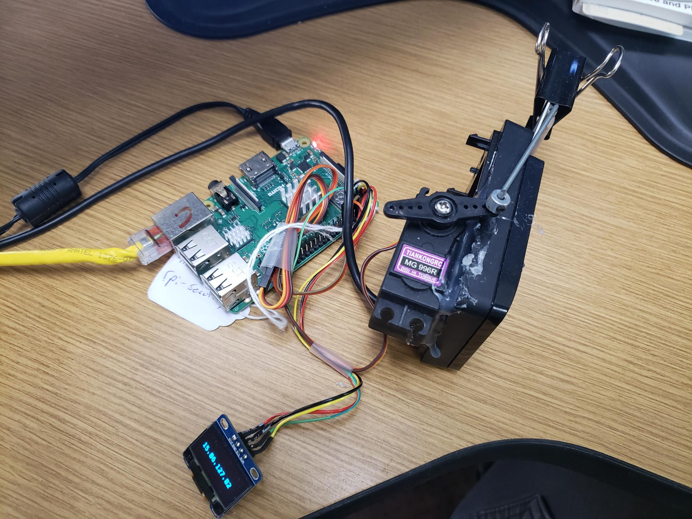

# cardcontrol
SmartCard automated control program.



### Web Client Usage Example "index.html"


### Web Client Usage Example "GET {URL}/insert {URL}/remove"


###  cardcontrol application usage


###  Install on virgin Raspberry PI
Create raspberry PI image (32 bit lite version, no desktop) on SD card.
* https://www.raspberrypi.com/software/
* install and use raspberry PI imager.
* Configure image ahead of time with:
*    hostname: rpi-security
*    username: pi
*    password: 4rpiuser!
*    ssh enabled

Install SD card with image and boot up. 

SSH into raspberry PI:
hostname: rpi-security
username: pi

note:  If hostname resolution does not work you can find the IP address of the RPI using the App "Fing" on your phone.

```
sudo apt update
sudo apt upgrade
sudo raspi-config "Enable interfaces I2C and ssh"
sudo apt install git

"Python stuff"
sudo apt install python3-dev
sudo apt-get -y install python3-pip
sudo pip3 install adafruit-circuitpython-ssd1306

"Nodejs stuff"
Go to:  https://deb.nodesource.com/ and follow instructions to install latest nodejs.
or simply...

sudo apt install nodejs
sudo npm install express -g

"WiringPi Library and Utility"
cd ~
mkdir git
cd ./git
sudo apt-get purge wiringpi
git clone https://github.com/WiringPi/WiringPi.git
cd ./wiringPi
git pull origin
./build

"Test wiring pi":  
gpio

"cardcontrol APP"
cd ~/git
git clone https://github.com/marau777/cardcontrol
cd ./cardcontrol
git pull --rebase
cd ./cardcontrol
sudo ./install.sh
cd ./src
npm install -g

"Test cardcontrol.py": 
../src/python3 cardcontrol.py insert
../src/python3 cardcontrol.py remove
 
"Test cardcontrol-webserver.js":  
../src/node cardcontrol-webserver.js

"Open browser and go to URL  ( http://{your IP address}:3000 ) and the homepage should come up"

```
Bill of Materials:

Raspberry PI 4 Kit (SD card, power suppy etc):
https://www.amazon.com/CanaKit-Raspberry-4GB-Starter-Kit/dp/B07V5JTMV9/ref=sr_1_2_sspa?crid=24B2GUW30SGQ7&keywords=raspberry%2Bpi%2B4&qid=1696428340&sprefix=raspb%2Caps%2C188&sr=8-2-spons&sp_csd=d2lkZ2V0TmFtZT1zcF9hdGY&th=1

I2C Display:

https://www.amazon.com/Hosyond-Display-Self-Luminous-Compatible-Raspberry/dp/B09C5K91H7/ref=sr_1_2_sspa?crid=21BFYGN0S6W24&keywords=i2c%2Bdisplay&qid=1696428897&sprefix=i2c%2Bdisplay%2Caps%2C219&sr=8-2-spons&sp_csd=d2lkZ2V0TmFtZT1zcF9hdGY&th=1


Wire Jumpers:

https://www.amazon.com/UCEC-Breadboard-Jumper-Ribbon-Cables/dp/B071XLM454/ref=sr_1_7_sspa?crid=RPP8YEG0B0T2&keywords=wire%2Bjumpers&qid=1696428949&sprefix=wire%2Bjumpers%2Caps%2C174&sr=8-7-spons&sp_csd=d2lkZ2V0TmFtZT1zcF9tdGY&th=1

Servos:

https://www.amazon.com/ETMall-Digital-Helicopter-Compatible-Raspberry/dp/B08CH2SJLR/ref=sr_1_2_sspa?crid=1Y7HZVC73XYVW&keywords=servo+metal&qid=1696429055&sprefix=servo+metal%2Caps%2C177&sr=8-2-spons&sp_csd=d2lkZ2V0TmFtZT1zcF9hdGY&psc=1

Push Rods:

https://www.amazon.com/0-047x10-24-Pushrods-0-79x0-43-Airplane-Aircraft/dp/B07X7PCV38/ref=sr_1_14_sspa?crid=9QAUW6X3FIDS&keywords=servo+steel+wire&qid=1696429342&sprefix=servo+steel+wire%2Caps%2C181&sr=8-14-spons&sp_csd=d2lkZ2V0TmFtZT1zcF9tdGY&psc=1

Brass Tubing:

https://www.amazon.com/Precision-Round-Brass-Telescopic-Thickness/dp/B07VLNMCRC/ref=sr_1_6?crid=W44RQCGT4ECG&keywords=brass+tubing&qid=1696429447&sprefix=brass+tubing%2Caps%2C179&sr=8-6

Hot Glue Gun:

https://www.amazon.com/DEWALT-QUICK-HEAT-CERAMIC-GLUE/dp/B00FI6QWBM/ref=sr_1_24?crid=2DYK8M0XHXGFC&keywords=dewalt+glue+gun&qid=1696429595&sprefix=dewalt+glue%2Caps%2C174&sr=8-24

Binder Clips:

https://www.amazon.com/Otylzto-Assorted-Storage-Container-Supplies/dp/B0C1CSDZJM/ref=sr_1_7?crid=2XDUMTEVGIVID&keywords=binder+clips&qid=1696429643&sprefix=binder+clips%2Caps%2C172&sr=8-7


##Wiring Pictures


