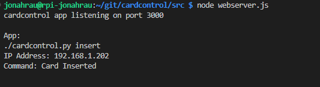
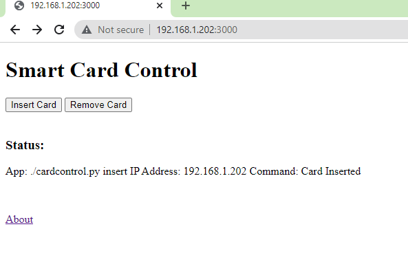
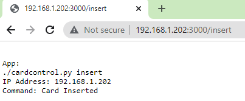
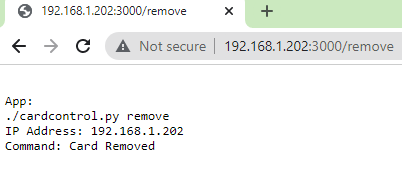
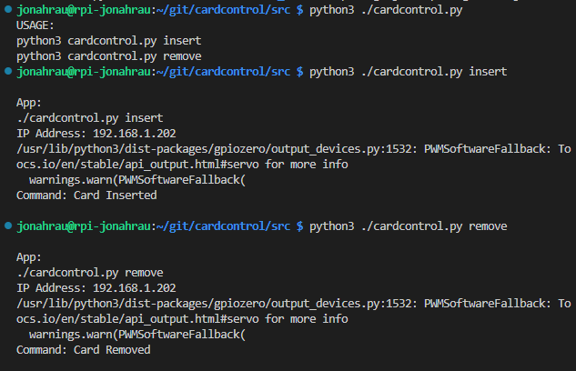

# cardcontrol
SmartCard automated control program.

### Start Web Server Example "node webserver.js"

### Web Client Usage Example "index.html"

### Web Client Usage Example "GET {URL}/insert {URL}/remove"

###  cardcontrol application usage

