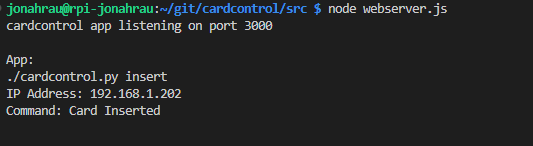
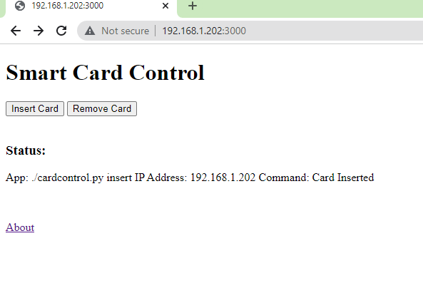
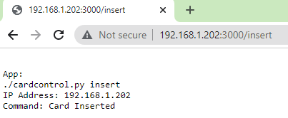
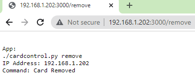
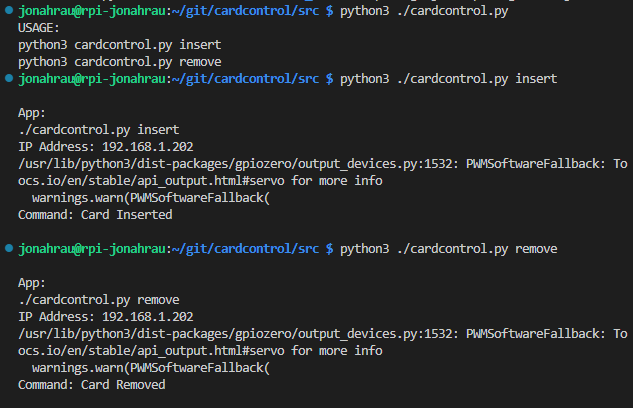
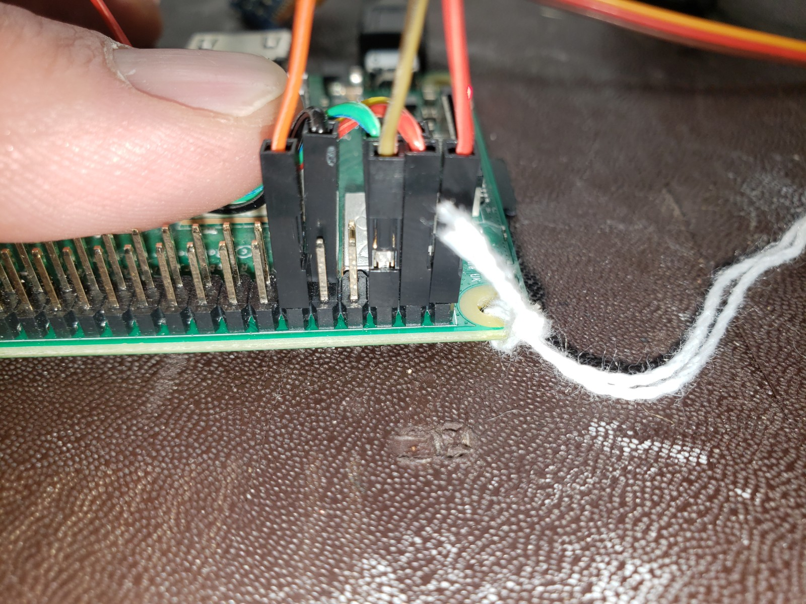
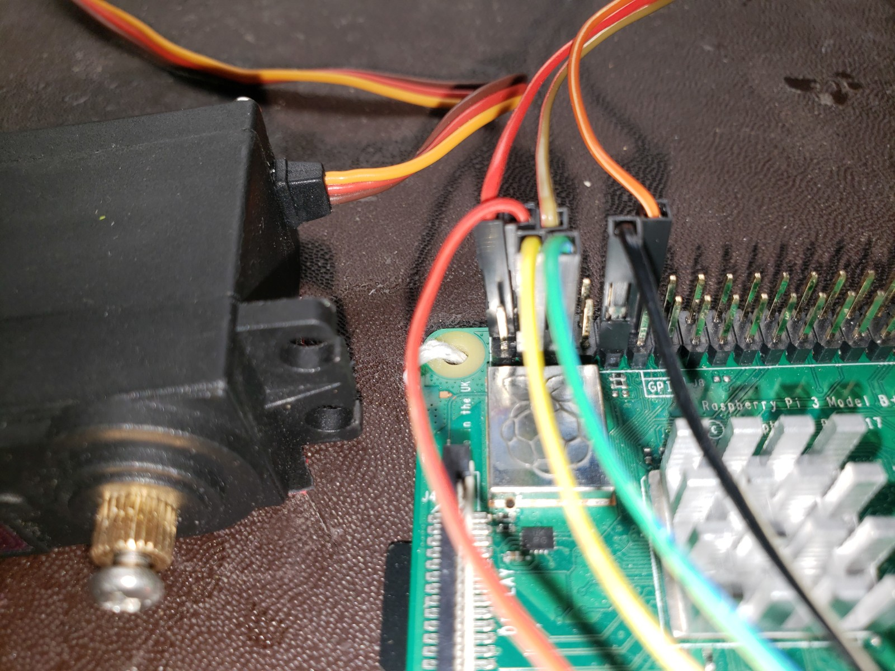
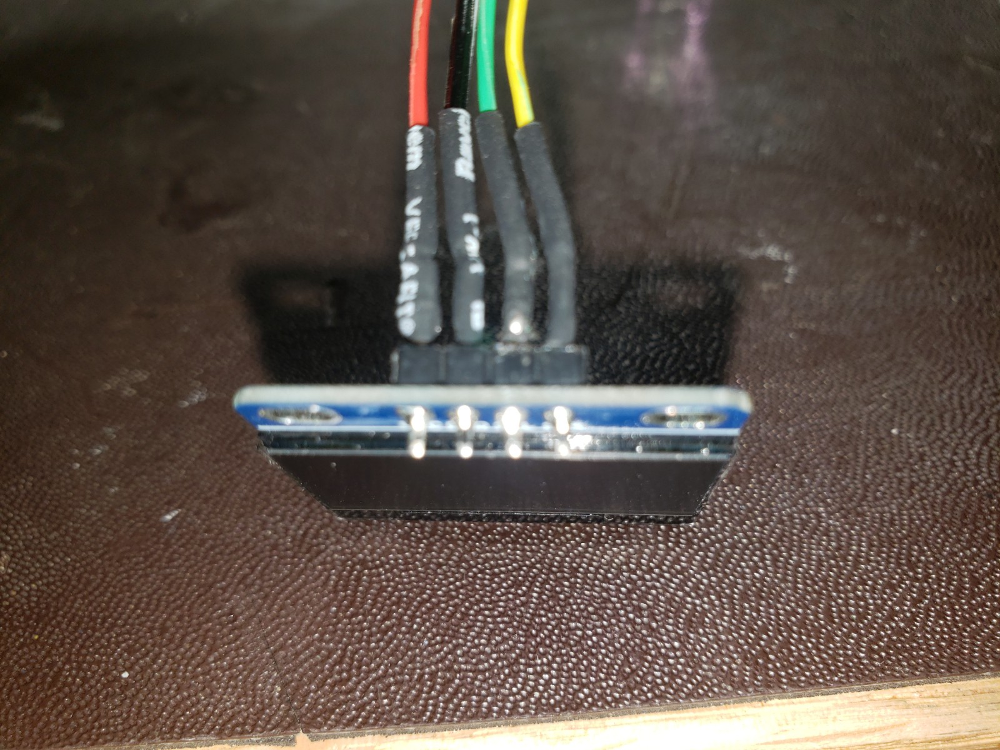

# cardcontrol
SmartCard automated control program.

### Start Web Server Example "node webserver.js"


### Web Client Usage Example "index.html"


### Web Client Usage Example "GET {URL}/insert {URL}/remove"


###  cardcontrol application usage




###  Install on virgin Raspberry PI

```
sudo apt-get update
sudo apt-get upgrade

sudo apt install git

"Python stuff"
sudo apt install python3-dev
sudo apt-get -y install python3-pip
pip3 install adafruit-circuitpython-ssd1306

"Nodejs stuff"
sudo apt install nodejs

"WiringPi Library and Utility"
cd ~
mkdir git
cd ./git
sudo apt-get purge wiringpi
git clone git://git.drogon.net/wiringPi
cd ./wiringPi
git pull origin
./build

"Test wiring pi":  
gpio

"cardcontrol APP"
cd ~/git
git clone https://github.com/marau777/cardcontrol
cd ./cardcontrol
cd src
git pull --rebase

"Test cardcontrol.py": 
python3 cardcontrol.py insert
python3 cardcontrol.py remove
 
"Test webserver.js":  
node webserver.js

"Open browser and go to URL  ( http://{your IP address}:3000 ) and the homepage should come up"

```

##Wiring Pictures



